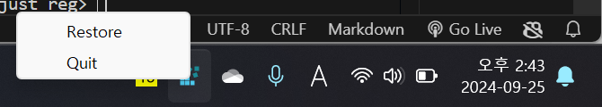
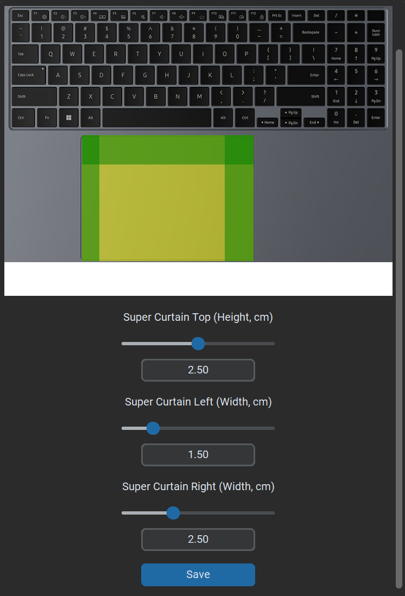
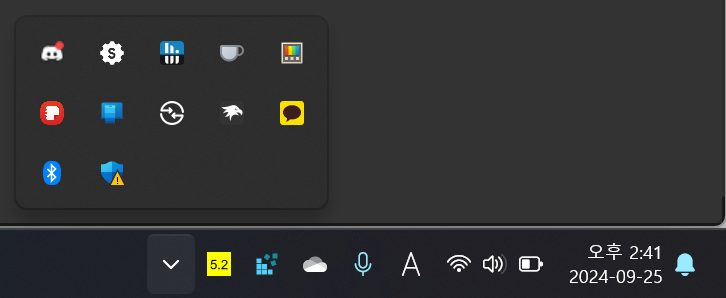

# MyWindows

**MyWindows** is a powerful tool designed to provide an intuitive interface for customizing various Windows settings and registry entries. Whether you want to fine-tune your trackpad, remap your keyboard, or monitor your battery, MyWindows makes it easy to personalize your Windows experience.

---

## Table of Contents

- [Installation](#installation)
- [Warning](#warning)
  - [Tested Conditions](#tested-conditions)
  - [Unsupported Environments](#unsupported-environments)
  - [Local Machines](#local-machines)
- [Features](#features)
  - [Trackpads](#trackpads)
    - [Curtains](#curtains)
    - [Super Curtains](#super-curtains)
    - [Right-click Zone](#right-click-zone)
    - [Notes](#notes-trackpads)
  - [Keyboards](#keyboards)
    - [Key Mapping](#key-mapping)
    - [Hotkey Remapping](#hotkey-remapping)
    - [Notes](#notes-keyboards)
  - [Taskbar](#taskbar)
  - [Battery](#battery)

---

## Installation

- Download the `MyWindows.exe` file and run the installer.

---

## Warning

### Tested Conditions
This program has been thoroughly tested under the following conditions:
- x86, Windows 11 Laptop, Intel Core Ultra 5 125H
- x86, Windows 11 Desktop, Ryzen 5 7500F CPU

### Unsupported Environments
The program may not function as expected under:
- ARM-based systems
- Windows 10 or earlier versions of Windows

### Local Machines
This tool modifies local machine registries, meaning that any changes made will affect the entire device, not just the current user.

### Unexpected behavior
Behaviors such as editing the registry through regedit and MyWindows simultaneously or using multiple keyboard-customizing programs could cause unexpected behavior.

If you lose track of the program, you can always right-click the tray icon for registry and bring it up to the surface.

---

## Features

### Trackpads

#### 1. Curtains
Curtain zones reduce touchpad sensitivity after keyboard use. Non-curtain zones remain responsive during or after keyboard use, improving palm rejection on touchpads.

#### 2. Super Curtains
Super Curtains designate areas of the touchpad where input cannot start. However, dragging a finger from an active zone into a super curtain zone will still register input.

Super Curtains disable:
1. Input that starts from the super curtain zones.
2. Taps that occur in super curtain zones.

#### 3. Right-click Zone
This feature controls the area of the touchpad where a right-click can be initiated, starting from the bottom-right corner. The size is set in percentage, and the configuration changes based on whether the device is set for right-handed or left-handed use.

#### 4. Notes (Trackpads)
The touchpad image used is an example, and the actual measurements are determined by the slider and input values. 

All registry edits can be manually modified or removed through: `HKEY_LOCAL_MACHINE\SOFTWARE\Microsoft\Windows\CurrentVersion\PrecisionTouchPad`. Remember to reboot after making changes.

More information: [Touchpad Tuning Guidelines](https://learn.microsoft.com/en-us/windows-hardware/design/component-guidelines/touchpad-tuning-guidelines)

---

### Keyboards

#### 1. Key Mapping
This feature remaps one key to another using the Scancode Map registry under: `HKEY_LOCAL_MACHINE\SYSTEM\CurrentControlSet\Control\Keyboard Layout`. Deleting this registry and rebooting will reset the keyboard to its default state.

#### 2. Hotkey Remapping
This feature remaps hotkey combinations, such as `Alt + Tab` feature to `Ctrl + Tab`. This feature does not modify the registry but relies on the Python 'keyboard' library. The program must run in the background for hotkey remapping to function.

#### 3. Notes (Keyboards)
There are alternative tools like Microsoft PowerToys and AutoHotKey, but this feature is integrated for convenience and customization. In case of issues, follow the registry instructions above to restore default settings.

---

### Taskbar (Feature In Development)
Future updates will include:
- Adjusting width
- Adjusting transparency
- Adjusting roundness

---

### Battery

#### 1. Display Battery Charge/Discharge Rate
This feature displays the battery charge or discharge rate in the system tray. The icon changes color based on charging (green) or discharging (yellow). You can disable the feature via a right-click on the icon or in the settings menu.

___________________________________________________

Features to add:

features with a question mark are not necessary, implement if possible features.

All config info regarding the screen is dealt in configuration_manager.py

Trackpad
- Trackpad width and height customization: Should be able for the user to input the width and height of their own trackpad
- Hence, green/yellow area, along with the changed maximum width/height, should be adjusted (Same slider, but different max length and rate of change)

Keyboard
- Disabling certain keys - Not started (probably add it to Keymapping?)

Battery discharge rate
- Change polling rate - should be done in settings?

Taskbar
- Control transparency
- Adjust the width/height of taskbar?

UI
- Rounded cornered windows
- Animation?
- Possible a theme to make the system more pleasing to watch

System
- Running in the background so that it consumes the least resources possible
- Registry path (Local machine vs User)

README
- Add images of actual use

Voltage/Clocks
- Last feature to be added, not sure if it's possible at the first place
- Adjusting voltages or clocks to allow for easy (underclocking/undervolting)

**Using a thread to run in background (IMPORTANT)**
- Battery drainage check
- Keyboard hotkeys remapping

If allowed by the user, these functions should be running in a separate thread from the main program that edits registries.

minimize instead of quit could replace this option maybe (check on resource usage)
--> 가급적이면 백그라운드 프로세스로 인식되도록 다른 쓰레드를 활용

**Update Image doesn't produce expected results**
- Bugs regarding taskbar looking transparent

**키보드 shortcut 활성화 비활성화**
- Works as expected, but bugs regarding color of the custom switch

**keyboard hotkey + battery discharge rate feature should launch at boot, if wanted by the user**

______________

