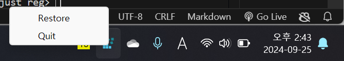
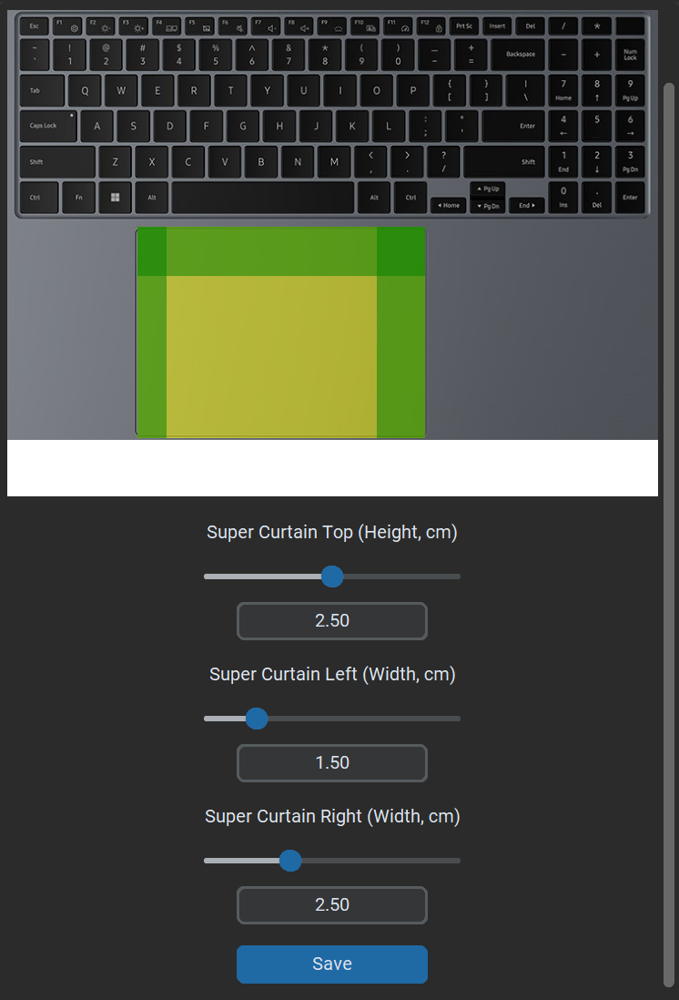
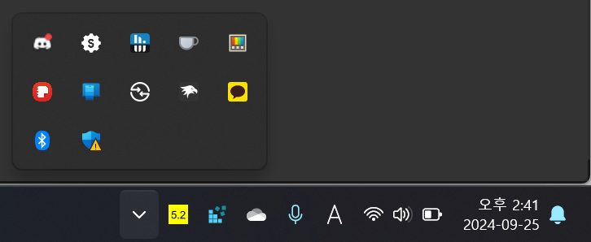

# MyWindows

**MyWindows** is a powerful tool designed to provide an intuitive interface for customizing various Windows settings and registry entries. Whether you want to fine-tune your trackpad, remap your keyboard, or monitor your battery, MyWindows makes it easy to personalize your Windows experience.

---

## Table of Contents

- [Installation](#installation)
- [Warning](#warning)
  - [Tested Conditions](#tested-conditions)
  - [Unsupported Environments](#unsupported-environments)
  - [Local Machines](#local-machines)
- [Features](#features)
  - [Trackpads](#trackpads)
    - [Curtains](#curtains)
    - [Super Curtains](#super-curtains)
    - [Right-click Zone](#right-click-zone)
    - [Notes](#notes-trackpads)
  - [Keyboards](#keyboards)
    - [Key Mapping](#key-mapping)
    - [Hotkey Remapping](#hotkey-remapping)
    - [Notes](#notes-keyboards)
  - [Taskbar](#taskbar)
  - [Battery](#battery)

---

## Installation

- Download the `MyWindows.exe` file and run the installer.

---

## Warning

### Tested Conditions
This program has been thoroughly tested under the following conditions:
- x86, Windows 11 Laptop, Intel Core Ultra 5 125H
- x86, Windows 11 Desktop, Ryzen 5 7500F CPU

### Unsupported Environments
The program may not function as expected under:
- ARM-based systems
- Windows 10 or earlier versions of Windows

### Local Machines
This tool modifies local machine registries, meaning that any changes made will affect the entire device, not just the current user.

### Unexpected behavior
Behaviors such as editing the registry through regedit and MyWindows simultaneously or using multiple keyboard-customizing programs could cause unexpected behavior.

If you lose track of the program, you can always right-click the tray icon for registry and bring it up to the surface.

---

## Features

### Trackpads

#### 1. Curtains
Curtain zones reduce touchpad sensitivity after keyboard use. Non-curtain zones remain responsive during or after keyboard use, improving palm rejection on touchpads.

#### 2. Super Curtains
Super Curtains designate areas of the touchpad where input cannot start. However, dragging a finger from an active zone into a super curtain zone will still register input.

Super Curtains disable:
1. Input that starts from the super curtain zones.
2. Taps that occur in super curtain zones.

#### 3. Right-click Zone
This feature controls the area of the touchpad where a right-click can be initiated, starting from the bottom-right corner. The size is set in percentage, and the configuration changes based on whether the device is set for right-handed or left-handed use.

#### 4. Notes (Trackpads)
The touchpad image used is an example, and the actual measurements are determined by the slider and input values. 

All registry edits can be manually modified or removed through: `HKEY_LOCAL_MACHINE\SOFTWARE\Microsoft\Windows\CurrentVersion\PrecisionTouchPad`. Remember to reboot after making changes.

More information: [Touchpad Tuning Guidelines](https://learn.microsoft.com/en-us/windows-hardware/design/component-guidelines/touchpad-tuning-guidelines)

---

### Keyboards

#### 1. Key Mapping
This feature remaps one key to another using the Scancode Map registry under: `HKEY_LOCAL_MACHINE\SYSTEM\CurrentControlSet\Control\Keyboard Layout`. Deleting this registry and rebooting will reset the keyboard to its default state.

#### 2. Hotkey Remapping
This feature remaps hotkey combinations, such as `Alt + Tab` feature to `Ctrl + Tab`. This feature does not modify the registry but relies on the Python 'keyboard' library. The program must run in the background for hotkey remapping to function.

#### 3. Notes (Keyboards)
There are alternative tools like Microsoft PowerToys and AutoHotKey, but this feature is integrated for convenience and customization. In case of issues, follow the registry instructions above to restore default settings.

---

### Taskbar (Feature In Development)
Future updates will include:
- Adjusting width
- Adjusting transparency
- Adjusting roundness

---

### Battery

#### 1. Display Battery Charge/Discharge Rate
This feature displays the battery charge or discharge rate in the system tray. The icon changes color based on charging (green) or discharging (yellow). You can disable the feature via a right-click on the icon or in the settings menu.

___________________________________________________

Features to add:

features with a question mark are not necessary, implement if possible features.

All config info regarding the screen is dealt in configuration_manager.py

Trackpad
- Trackpad width and height customization: Should be able for the user to input the width and height of their own trackpad
- Hence, green/yellow area, along with the changed maximum width/height, should be adjusted (Same slider, but different max length and rate of change)

Keyboard
- Keymapping (Remapping) - completed
- Disabling certain keys - Not started (probably add it to Keymapping?)
- shortcuts - have to work on combinations and dynamic size for dropdown combobox (dynamic sizing for dropdown fixed)

Battery discharge rate
- Change polling rate - should be done in settings

Taskbar
- Control transparency
- Adjust the width/height of taskbar?

UI
- Rounded cornered windows
- Animation?
- Possible a theme to make the system more pleasing to watch

System
- Running in the background so that it consumes the least resources possible
- Registry path (Local machine vs User)

README
- Add images of actual use

Voltage/Clocks
- Last feature to be added, not sure if it's possible at the first place
- Adjusting voltages or clocks to allow for easy (underclocking/undervolting)

**Using a thread to run in background (IMPORTANT)**
- Battery drainage check
- Keyboard hotkeys remapping

If allowed by the user, these functions should be running in a separate thread from the main program that edits registries.

minimize instead of quit could replace this option maybe (check on resource usage)
--> 가급적이면 백그라운드 프로세스로 인식되도록 다른 쓰레드를 활용

_______________

Attribution: The only requirement of the MIT License is that you must include the original license notice in your project. This means that if you distribute your software (whether for free or for profit), you need to provide credit to the original author of CustomTkinter, typically by including a copy of the license in your product’s documentation.

MIT License attribute 해야됨 커스팀 tkinter 쓸꺼면
______________

custom tkinter 로 gui 업그레이드 완료, 주요 기능들 구현 완료

구현해야 되는거

레지스터 수정시 reboot prompt
save 누르면 백업할지 물어보는 기능 추가
노트북에서 기능테스트 한번 더

추가 아이디어:

키매핑

1. 시작 메뉴 검색 속도 향상
위치: HKEY_CURRENT_USER\Software\Microsoft\Windows\CurrentVersion\Explorer\Advanced
변경: 새 DWORD(32비트) 값으로 DisabledSearchBoxSuggestions를 생성하고 값을 1로 설정합니다.
효과: 시작 메뉴 검색 시 불필요한 웹 검색 제안을 제거하여 검색 속도를 높일 수 있습니다.
2. 부팅 속도 향상 (메뉴 지연 시간 단축)
위치: HKEY_CURRENT_USER\Control Panel\Desktop
변경: MenuShowDelay 값을 400에서 100 또는 0으로 변경합니다.
효과: 메뉴의 지연 시간을 줄여 부드러운 사용자 경험을 제공합니다.
3. 최대 절전 모드 활성화/비활성화
위치: HKEY_LOCAL_MACHINE\SYSTEM\CurrentControlSet\Control\Power
변경: HibernateEnabled 값을 1로 변경하여 최대 절전 모드를 활성화하고, 0으로 설정하면 비활성화됩니다.
효과: 하드 드라이브 공간을 절약하거나 전원 옵션을 개선할 수 있습니다.
4. 작업 표시줄 미리보기 크기 조정
위치: HKEY_CURRENT_USER\Software\Microsoft\Windows\CurrentVersion\Explorer\Taskband
변경: MinThumbSizePx라는 DWORD(32비트) 값을 생성하고 원하는 크기(예: 100)를 입력합니다.
효과: 작업 표시줄 미리보기 창의 크기를 조정할 수 있습니다.
5. 드라이브 자동 숨김 (탐색기에서 특정 드라이브 숨기기)
위치: HKEY_LOCAL_MACHINE\SOFTWARE\Microsoft\Windows\CurrentVersion\Policies\Explorer
변경: NoDrives라는 DWORD 값을 추가하고, 숨기고자 하는 드라이브에 따라 값을 설정합니다.
효과: 탐색기에서 특정 드라이브를 숨길 수 있습니다.
6. 윈도우 업데이트 자동 재부팅 방지
위치: HKEY_LOCAL_MACHINE\SOFTWARE\Policies\Microsoft\Windows\WindowsUpdate\AU
변경: NoAutoRebootWithLoggedOnUsers 값을 1로 설정하여 자동 재부팅을 방지합니다.
효과: 업데이트 후 자동으로 PC가 재부팅되는 것을 방지할 수 있습니다.
7. 파일 탐색기에서 "이 PC"에 대한 바로 가기 비활성화
위치: HKEY_LOCAL_MACHINE\SOFTWARE\Microsoft\Windows\CurrentVersion\Explorer\MyComputer\NameSpace
변경: 여기서 원하지 않는 바로 가기 폴더의 하위 키를 삭제합니다.
효과: 파일 탐색기에서 "이 PC"에 표시되는 기본 바로 가기 항목을 제거할 수 있습니다.
8. Windows Defender 비활성화
위치: HKEY_LOCAL_MACHINE\SOFTWARE\Policies\Microsoft\Windows Defender
변경: DisableAntiSpyware 값을 1로 설정하여 Windows Defender를 비활성화합니다.
효과: 다른 보안 프로그램을 사용할 경우 Windows Defender를 끌 수 있습니다.
9. 작업 표시줄의 투명도 활성화
위치: HKEY_LOCAL_MACHINE\SOFTWARE\Microsoft\Windows\CurrentVersion\Explorer\Advanced
변경: UseOLEDTaskbarTransparency라는 DWORD(32비트) 값을 생성하고 값을 1로 설정합니다.
효과: 작업 표시줄의 투명도를 더 강화할 수 있습니다.
10. 콘텍스트 메뉴 항목 제거
위치: HKEY_CLASSES_ROOT\*\shellex\ContextMenuHandlers
변경: 특정 프로그램의 콘텍스트 메뉴 항목을 삭제할 수 있습니다.
효과: 우클릭 메뉴에서 불필요한 항목을 제거하여 간소화할 수 있습니다.
이 외에도 다양한 설정이 가능하지만, 잘못된 수정은 시스템 문제를 일으킬 수 있으므로 레지스트리 수정 전에 백업을 권장합니다.